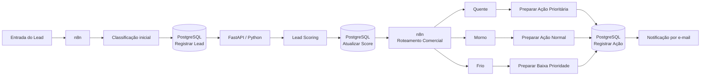
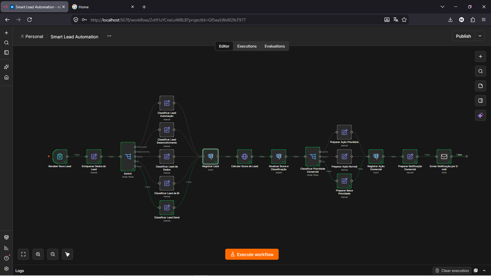
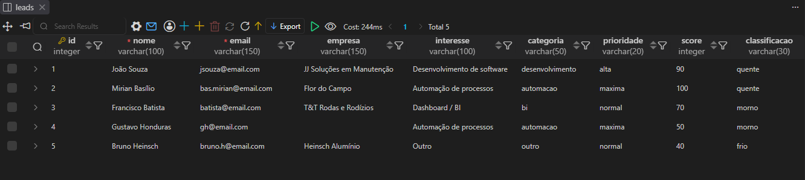
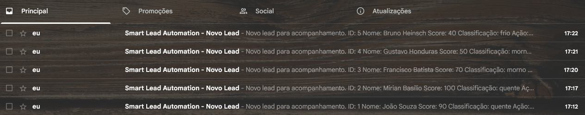

# Smart Lead Automation

Automação de qualificação e roteamento de leads usando **n8n**, **PostgreSQL**, **Python**, **FastAPI** e **Docker**.

O projeto recebe um novo lead, enriquece e classifica seus dados no n8n, registra as informações no PostgreSQL, envia o lead para uma API em Python que calcula um **score de 0 a 100**, classifica o lead como **quente, morno ou frio** e devolve o resultado para o workflow. A partir dessa classificação, o n8n define a prioridade comercial, registra a ação correspondente e envia uma notificação por e-mail.

> **Status:** v1.0 — fluxo funcional ponta a ponta, com scoring determinístico e integração entre n8n, PostgreSQL e API Python.

---

## Visão geral

O objetivo do Smart Lead Automation é demonstrar, em um único projeto de portfólio, conceitos de automação de processos, integração entre sistemas, APIs REST, regras de negócio em Python, persistência de dados com PostgreSQL, orquestração de workflows com n8n e conteinerização de serviços com Docker.

A versão 1.0 utiliza regras determinísticas para o scoring. A interpretação semântica da mensagem por um agente de IA fica reservada para uma evolução futura do projeto.

---

## Arquitetura



Na arquitetura atual:

- **n8n** e **PostgreSQL** são executados em containers Docker;
- a API Python é executada localmente em um ambiente virtual `.venv`;
- o n8n acessa a API Python pelo endereço `host.docker.internal`;
- o Python acessa o PostgreSQL pela porta exposta no host.
    - **Python → PostgreSQL** → `localhost:5433`
    - **n8n → PostgreSQL** → `postgres:5432`

---

## Workflow n8n

O fluxo principal da versão 1.0:

1. recebe um novo lead;
2. enriquece os dados;
3. classifica o tipo de interesse;
4. registra o lead no PostgreSQL;
5. chama a API Python para calcular o score;
6. atualiza score e classificação no banco;
7. roteia o lead como quente, morno ou frio;
8. prepara a ação comercial correspondente;
9. registra a ação;
10. envia uma notificação por e-mail.



---

## Regra de scoring

A versão 1.0 utiliza regras explícitas e auditáveis.

### Pontuação por categoria

| Categoria | Pontos |
|---|---:|
| Automação | 50 |
| Desenvolvimento | 40 |
| Dados | 40 |
| BI / Dashboard | 20 |
| Outro | 20 |

### Pontos adicionais

| Critério | Pontos |
|---|---:|
| Empresa informada | +20 |
| Mensagem informada | +30 |

O score máximo é **100 pontos**.

### Classificação final

| Score | Classificação |
|---|---|
| 80 a 100 | Quente |
| 50 a 79 | Morno |
| 0 a 49 | Frio |

Exemplos observados nos testes:

- Automação completa → `100` → **quente**
- Desenvolvimento completo → `90` → **quente**
- BI completo → `70` → **morno**
- Automação incompleta → `50` → **morno**
- Outro incompleto → `40` → **frio**



---

## Tecnologias utilizadas

- **Python**
- **FastAPI**
- **Uvicorn**
- **psycopg2**
- **python-dotenv**
- **PostgreSQL 17**
- **n8n**
- **Docker / Docker Compose**
- **Git / GitHub**

---

## Estrutura do projeto

```text
smart-lead-automation/
│
├── database/
│   └── schema.sql
│
├── n8n/
│   └── Smart Lead Automation.json
│
├── python-service/
│   ├── database.py
│   ├── lead_scoring.py
│   ├── lead_service.py
│   ├── main.py
│   ├── requirements.txt
│   └── .env.example
│
├── screenshots/
│   ├── workflow-v1.png
│   ├── resultado-postgresql.png
│   └── notificacoes-email.png
│
├── .env.example
├── .gitignore
├── docker-compose.yml
└── README.md
```

---

## Organização do código Python

O serviço Python foi separado em responsabilidades.

`database.py` - Responsável pela conexão com o PostgreSQL e pelas consultas ao banco.

`lead_scoring.py` - Contém as regras de negócio para calcular o score, registrar os motivos da pontuação e definir a classificação final.

`lead_service.py` - Coordena o acesso aos dados e a regra de scoring.

`main.py` - Expõe a aplicação por meio do FastAPI.

Exemplo de endpoint:

```text
GET /leads/{lead_id}
```

Resposta simplificada:

```json
{
  "lead": {
    "id": 1,
    "nome": "Exemplo",
    "categoria": "automacao"
  },
  "analise": {
    "score": 100,
    "classificacao": "quente",
    "motivos": [
      "+50 pontos categoria 'automacao'",
      "+20 pontos empresa informada",
      "+30 pontos mensagem informada"
    ]
  }
}
```

---

# Como executar

## Pré-requisitos

É necessário ter instalado:

- Git;
- Docker Desktop / Docker Compose;
- Python 3;
- um navegador para acessar o n8n e a documentação da API.

O projeto foi desenvolvido e testado em **Windows com PowerShell e Docker Desktop**.

---

## 1. Clonar o repositório

```powershell
git clone git@github.com:vitormazon12/smart-lead-automation.git
cd smart-lead-automation
```

---

## 2. Configurar as variáveis do Docker

Copie o arquivo de exemplo:

```powershell
Copy-Item .env.example .env
```

Edite o `.env` criado:

```env
POSTGRES_USER=n8n_user
POSTGRES_PASSWORD=sua_senha
POSTGRES_DB=leads_db
POSTGRES_PORT=5433
```

> O arquivo `.env` real não é versionado pelo Git.

---

## 3. Subir n8n e PostgreSQL

Na raiz do projeto:

```powershell
docker compose up -d
```

Verifique os containers:

```powershell
docker compose ps
```

O n8n ficará disponível em:

```text
http://localhost:5678
```

O PostgreSQL ficará exposto no host pela porta configurada no `.env` — por padrão, `5433`.

---

## 4. Criar as tabelas do banco

O arquivo:

```text
database/schema.sql
```

cria as tabelas necessárias para o projeto.

No PowerShell:

```powershell
Get-Content .\database\schema.sql |
docker compose exec -T postgres psql -U n8n_user -d leads_db
```

Se você alterar `POSTGRES_USER` ou `POSTGRES_DB`, ajuste o comando de acordo com o seu `.env`.

Também é possível executar o `schema.sql` por um cliente PostgreSQL de sua preferência.

---

## 5. Configurar o serviço Python

Entre na pasta:

```powershell
cd .\python-service\
```

Crie um ambiente virtual:

```powershell
python -m venv .venv
```

Ative:

```powershell
.\.venv\Scripts\Activate.ps1
```

Instale as dependências:

```powershell
pip install -r requirements.txt
```

Copie o arquivo de exemplo:

```powershell
Copy-Item .env.example .env
```

Configure:

```env
DB_HOST=localhost
DB_PORT=5433
DB_NAME=leads_db
DB_USER=n8n_user
DB_PASSWORD=sua_senha
```

As credenciais devem ser compatíveis com as utilizadas pelo PostgreSQL.

---

## 6. Iniciar a API

Ainda dentro de `python-service`:

```powershell
uvicorn main:app --reload --host 0.0.0.0 --port 8000
```

Teste:

```text
http://127.0.0.1:8000/
```

Documentação automática do FastAPI:

```text
http://127.0.0.1:8000/docs
```

Depois que um lead estiver registrado:

```text
http://127.0.0.1:8000/leads/1
```

---

## 7. Importar o workflow no n8n

No n8n:

1. importe o arquivo `n8n/Smart Lead Automation.json`;
2. configure uma credencial PostgreSQL;
3. configure a credencial utilizada no envio de e-mail;
4. substitua os endereços de e-mail de exemplo pelos seus;
5. confira a URL utilizada no node HTTP Request.

Como o n8n está em Docker e a API Python está sendo executada no Windows, o container deve acessar a máquina host por:

```text
http://host.docker.internal:8000
```

Dentro da rede Docker, o n8n deve acessar o PostgreSQL utilizando:

```text
Host: postgres
Port: 5432
```

Esses valores são diferentes de `localhost:5433`, utilizado pelo Python no host.

---

## Notificações

Ao final do fluxo, o n8n envia uma notificação contendo informações como ID do lead, nome, score, classificação e ação comercial.



Os endereços presentes no workflow público são apenas exemplos e devem ser configurados pelo usuário após a importação.

---

## Testes realizados

Foram testados diferentes cenários para validar o comportamento do scoring e do roteamento comercial, incluindo diferentes categorias de serviço, leads completos e incompletos, classificações quente/morno/frio, persistência no PostgreSQL, chamada da API pelo n8n, atualização do score no banco, registro de ação comercial e envio da notificação final.

---

## Segurança e configuração

Dados sensíveis não são mantidos no repositório.

Os seguintes itens são ignorados pelo Git:

```text
.env
python-service/.env
python-service/.venv/
__pycache__/
```

Os arquivos `.env.example` documentam apenas quais variáveis precisam ser configuradas.

Antes de publicar ou reutilizar um workflow n8n, revise também credenciais, tokens, endereços de e-mail e outros valores inseridos manualmente.

---

## Limitações da versão 1.0

A classificação da categoria ocorre por regras definidas no workflow e o scoring do Python é determinístico.

Na versão atual, a presença da mensagem vale pontos, mas seu conteúdo não é interpretado semanticamente.

Essa decisão mantém a V1 simples, auditável e fácil de testar.

---

## Próximos passos

Uma futura versão 2.0 pode incluir:

- agente de IA em Python para interpretar a mensagem do lead;
- avaliação de intenção e contexto comercial;
- recomendação automática de próxima ação;
- dockerização do serviço Python;
- testes automatizados;
- autenticação da API;
- dashboard de acompanhamento dos leads;
- evolução das regras de scoring a partir de dados históricos.

---

## Resultado

O Smart Lead Automation v1.0 demonstra uma automação completa envolvendo:

**entrada de dados → classificação → persistência → API → scoring → decisão → registro → notificação**

O projeto foi desenvolvido como prática de integração entre automação, desenvolvimento Python, bancos de dados e arquitetura de serviços.

---

## Autor

**Vitor Mazon**

Projeto desenvolvido para estudo e portfólio nas áreas de automação, desenvolvimento, dados e integração de sistemas.
